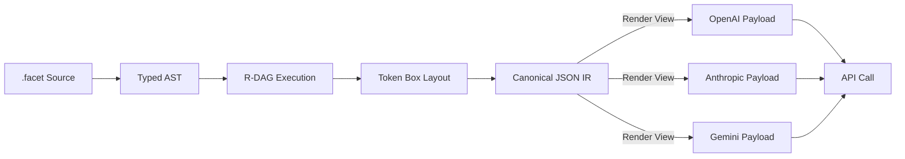

# Canonical JSON Model

## Purpose

The Canonical JSON Model defines the **stable, deterministic representation** of AI execution state produced by a FACET-compliant system.

Its goal is to ensure that:

* identical inputs produce **byte-for-byte identical JSON**
* outputs are comparable, cacheable, diffable, and replayable
* provider-specific formats do not leak nondeterminism into downstream systems

Canonical JSON is the **boundary artifact** between deterministic compilation and probabilistic model execution.

---

## Why Canonical JSON Is Necessary

Modern LLM stacks suffer from hidden nondeterminism:

* field reordering in JSON objects
* optional fields appearing/disappearing
* provider-specific message layouts
* streaming vs non-streaming structural drift
* implicit defaults applied at runtime

These effects make:

* caching unreliable
* replay impossible
* regression testing meaningless
* auditing and compliance fragile

Canonical JSON eliminates these failure modes by enforcing a **single normalized shape**.

---

## Definition

A **Canonical JSON Document** is a JSON object that satisfies all of the following:

1. Deterministic field ordering
2. Explicit presence or absence of all optional fields
3. Stable numeric and string encoding
4. Provider-agnostic structure
5. Fully derived from a typed execution state

FACET treats Canonical JSON as a **compiled artifact**, not a serialization convenience.

---

## Canonical Ordering Rules

FACET enforces a strict top-level ordering:

1. `meta`
2. `system`
3. `tools`
4. `examples`
5. `history`
6. `user`
7. `assistant`
8. `output`

This ordering is **normative** and MUST be preserved by all compliant implementations.

Nested objects follow:

* lexical key ordering (UTF-8, codepoint order)
* stable list ordering derived from execution order or explicit keys

---

## Explicitness Rules

Canonical JSON forbids implicit defaults and structural ambiguity.

Rules:

* **Optional Fields:** Fields defined in the schema but missing from the runtime value **MUST** be explicitly rendered as `null`. Omission of known fields is **PROHIBITED**.
* **Empty Lists:** **MUST** be rendered as `[]`.
* **Empty Objects:** **MUST** be rendered as `{}`.
* **Booleans:** **MUST** always be explicit (`true` / `false`).

**Rationale:** Explicit `null` guarantees that the JSON structure (keyset) remains constant regardless of data content, enabling O(1) shape verification and stable hashing across languages with different default serialization behaviors (e.g., JavaScript vs. Rust).

---

## Numeric and String Normalization

To avoid cross-platform drift:

* Integers are rendered without leading zeros
* Floats use normalized decimal form (no exponent unless required)
* Strings are UTF-8, NFC-normalized
* Escaping follows JSON standard, no alternative encodings

Implementations MUST NOT emit:

* NaN
* Infinity
* locale-dependent number formats

---

## Relationship to FACET Execution Phases

Canonical JSON is produced at the **end of Phase 5 (Render)**.

Inputs:

* Typed AST
* Computed variable map
* Finalized Token Box layout
* Interface schemas

Outputs:

* One canonical JSON document
* Zero ambiguity about structure or meaning

Any violation at this stage MUST abort execution rather than emit a non-canonical result.

---

## Canonical JSON vs Provider Payloads



*Canonical JSON is the single source of truth. Provider payloads are disposable views.*

Provider payloads (OpenAI, Anthropic, Gemini, etc.) are **derived views** of Canonical JSON, not sources of truth.

### Vendor Lock-in Prevention

Canonical JSON establishes a **hard architectural boundary** between:

* **what the system decided** (deterministic execution state)
* **how a specific provider expects to receive it** (vendor payload)

FACET enforces the rule:

> *All provider payloads are ephemeral. Canonical JSON is permanent.*

This has critical consequences:

* Switching providers **does not invalidate history**
* Stored executions remain replayable even if a vendor API changes
* Audits and compliance reports are immune to provider schema drift
* Bugs in a provider adapter cannot corrupt the core execution record

In practice:

* Canonical JSON is stored, hashed, diffed, and cached
* Provider payloads are generated **just-in-time** and discarded

This makes vendor lock-in structurally impossible at the execution layer.

### Failure Containment

If a provider:

* rejects a payload
* enforces undocumented constraints
* changes streaming semantics

The failure is isolated to the **adapter layer**.

Canonical JSON remains valid, stable, and reusable.

This separation is what allows FACET systems to survive API churn without rewriting agent logic.

---

## Canonical JSON and @test / Snapshot Testing

Canonical JSON enables **true snapshot testing** for AI systems.

Because Canonical JSON is:

* byte-for-byte deterministic
* provider-agnostic
* fully explicit in structure

it can be safely used as a **golden snapshot artifact**.

### Snapshot Testing Model

In a FACET test (`@test`):

1. The full execution pipeline runs in Pure Mode
2. Canonical JSON is produced
3. The JSON is hashed and/or stored as a snapshot
4. Future runs compare against this snapshot

```facet
@test "payment flow"
  vars:
    amount: 100
    currency: "USD"

  assert:
    - canonical_json_hash == "b3e2…"
```

This guarantees:

* logic changes are immediately visible
* provider drift cannot invalidate tests
* regressions are caught before deployment

### Enterprise Impact

For enterprise systems, this enables:

* deterministic CI pipelines
* audit-safe execution logs
* reproducible incident analysis
* long-term caching with cryptographic guarantees

Canonical JSON turns AI behavior into **versioned, testable artifacts**—not ephemeral model outputs.

---

## Determinism Guarantees

If all of the following are true:

* same FACET document
* same inputs
* same execution mode (Pure)
* same lens registry

Then:

* Canonical JSON MUST be identical
* Hash(canonical_json) MUST be identical
* Downstream behavior MUST be reproducible

This is the foundation for:

* memoization
* snapshot testing
* deterministic agents

---

## Comparison: Canonical vs Ad-hoc JSON

| Property         | Ad-hoc JSON | Canonical JSON |
| ---------------- | ----------- | -------------- |
| Field order      | Unstable    | Deterministic  |
| Optional fields  | Implicit    | Explicit       |
| Provider leakage | High        | None           |
| Diff-friendly    | No          | Yes            |
| Cache-safe       | No          | Yes            |
| Replayable       | No          | Yes            |

---

## Design Principle

> JSON is not a data format.
> JSON is a **semantic boundary**.

Canonical JSON turns that boundary into something that can be reasoned about, tested, and trusted.

---

## LLVM Analogy (Industry Context)

FACET Canonical JSON plays the same role in AI systems that **LLVM IR** plays in compilers.

| Compiler Stack | FACET Stack                                    |
| -------------- | ---------------------------------------------- |
| Source Code    | `.facet` document                              |
| AST            | Typed FACET AST                                |
| LLVM IR        | Canonical JSON                                 |
| Target Backend | Provider Adapter (OpenAI / Anthropic / Gemini) |
| Machine Code   | Provider Payload                               |

Key properties shared with LLVM IR:

* **Provider-independent representation**
* **Deterministic and stable shape**
* **Diffable and inspectable**
* **Safe target for optimization, caching, and replay**

Just as LLVM allows one program to target x86, ARM, or WebAssembly without changing source code,

FACET allows one agent architecture to target multiple LLM providers without changing execution semantics.

This is why Canonical JSON is treated as an **Intermediate Representation**, not a serialization detail.

Once this layer exists, provider payloads become replaceable implementation details.

---

## Status

This document defines the **normative Canonical JSON Model** for FACET v2.0 and later.

All compliant implementations MUST follow these rules when producing canonical execution output.
